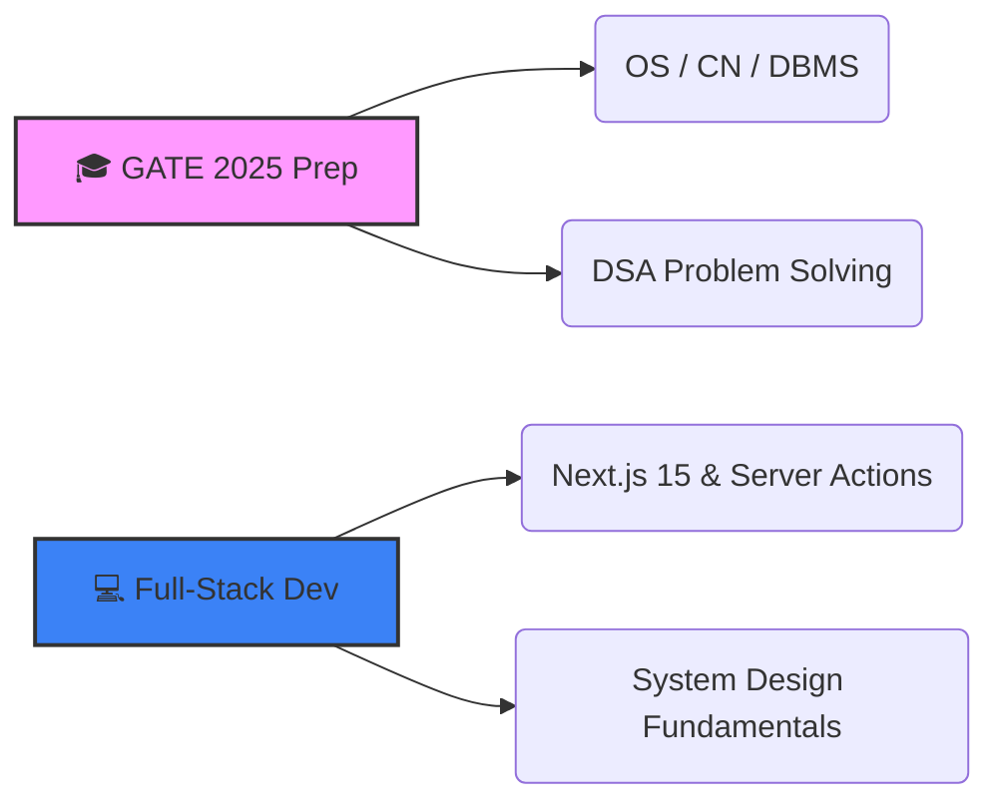

  

  <samp>
    <a href="https://www.buildfolio.space/harsh-tech">🌐 Portfolio</a> •
    <a href="https://www.linkedin.com/in/harshad-hatagale">💼 LinkedIn</a> •
    <a href="mailto:harshadhatagale5@gmail.com">📩 Email</a>
  </samp>

---

### 🧠 Technical Profile

*   🎓 **Education:** Computer Science & Engineering @ Government College of Engineering, Jalgaon
*   🔭 **Current Focus:** Building production-grade applications with **Next.js** & **Node.js**; Preparing for **GATE 2025 (CS & IT)** .
*   🌱 **Core CS:** Deep diving into **Operating Systems**, **DBMS**, and **Computer Networks**.
*   💡 **Philosophy:** *"Clean code, scalable architecture, and continuous learning."*

 

### 🛠️ Technology Stack

<table align="center">
  <tr>
    <td align="center" width="96">
      
       JavaScript
    </td>
    <td align="center" width="96">
      
       TypeScript
    </td>
    <td align="center" width="96">
      
       React
    </td>
    <td align="center" width="96">
      
       Next.js
    </td>
    <td align="center" width="96">
      
       Python
    </td>
    <td align="center" width="96">
      
       C++
    </td>
  </tr>
  <tr>
    <td align="center" width="96">
      
       Node.js
    </td>
    <td align="center" width="96">
      
       Express
    </td>
    <td align="center" width="96">
      
       MySQL
    </td>
    <td align="center" width="96">
      
       MongoDB
    </td>
    <td align="center" width="96">
      
       Tailwind
    </td>
    <td align="center" width="96">
      
       Git
    </td>
  </tr>
</table>

 

### 🚀 Featured Projects

  <table>
    <tr>
      <td width="50%">
        <h3 align="center">📄 AI Resume Builder</h3>
        

          
          
           
          <samp>GPT-powered dynamic resume generation with ATS optimization and intelligent content suggestions.</samp>
        

      </td>
      <td width="50%">
        <h3 align="center">🛒 E-Commerce Platform</h3>
        

          
          
           
          <samp>Full-stack marketplace with secure authentication, role-based access control, and payment gateway integration.</samp>
        

      </td>
    </tr>
    <tr>
      <td width="50%">
        <h3 align="center">🎨 Portfolio Builder</h3>
        

          
          
           
          <samp>Drag-and-drop interface for developers to generate and deploy custom portfolio websites in minutes.</samp>
        

      </td>
      <td width="50%">
        <h3 align="center">📊 Return Analyzer</h3>
        

          
          
           
          <samp>AI-driven e-commerce tool analyzing product images and metadata to predict return probability.</samp>
        

      </td>
    </tr>
  </table>

 

### 📈 GitHub Analytics

  

  

 

### 🎯 2025 Roadmap

 <i>"Consistency over motivation. Focus over noise."</i>     

